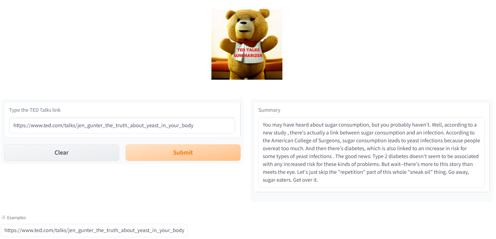

# ted_talks_summarizer

This project aims to summarize TED talks (https://www.ted.com/) videos. It creates short summary of ted talk from given url.

It is deployed via Gradio. 

App demo link:

https://huggingface.co/spaces/remzicam/ted_talks_summarizer

The process can be slow in huggingface space. Alternatively you can try it on google colab:

[]
(https://colab.research.google.com/github/r-c-c/ted_talks_summarizer/blob/main/ted_talk_transcriber.ipynb)

Sample from app:

